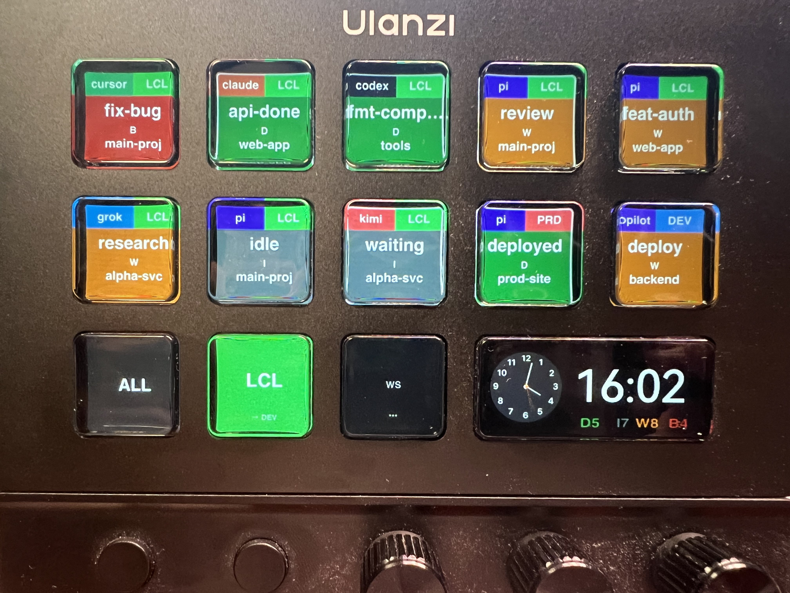

# herdr-ulanzi-deck

在 **Ulanzi D200X** 上显示 [herdr](https://herdr.dev) AI 编程 Agent 的状态。

<p align="center">
  
</p>

## 功能

- **实时 Agent 状态** — 通过 Unix socket 读取 herdr 的 workspaces 和 agents，显示在 D200X 的 LCD 按键上
- **多机器支持** — 同时连接多台机器的 herdr（本机直连 + 远程 SSH 隧道）
- **优先级排序** — 按状态排序：BLOCKED → DONE → WORKING → IDLE → UNKNOWN
- **过滤导航** — K11=全部机器、K12=机器循环、K13=Space 循环
- **品牌色** — 每个 Agent 有独立品牌色作为状态背景色（Pi=紫、Claude=暖棕、Cursor=青绿...）
- **机器色** — 每台机器的连接有定义色（显示在 K12 按钮背景上）

## 工作原理

```
Herdr Unix Socket  → herdr-client  →  herdr-bridge  →  StateManager
                                                          │
                    UlanziDeck D200X  ←  DeckClient  ←  ButtonMapper
                                                   ←  IconRenderer (SVG→PNG)
```

1. 插件通过 Unix socket JSON-line API 读取 herdr 数据
2. 合并多机器数据为统一 workspace 树
3. 按状态优先级排序，按当前过滤模式（ALL/机器/space）筛选
4. 生成带品牌色的 SVG 图标 → 通过 `sharp` 转为 PNG
5. 通过 WebSocket（端口 3906）发送 state 命令到 UlanziDeck

## 安装

### 1. 安装插件

```bash
# 将插件复制到 UlanziDeck 插件目录
cp -r herdr-ulanzi-deck \
  ~/Library/Application\ Support/Ulanzi/UlanziDeck/Plugins/com.ulanzi.herdr.agentview.ulanziPlugin
```

### 2. 安装依赖

```bash
cd ~/Library/Application\ Support/Ulanzi/UlanziDeck/Plugins/com.ulanzi.herdr.agentview.ulanziPlugin
npm install
```

### 3. 配置连接

创建 `~/.config/herdr-deck/connections.json`：

```json
{
  "connections": [
    {
      "name": "local",
      "abbr": "LCL",
      "color": "#4ADE80",
      "type": "local"
    },
    {
      "name": "dev-server",
      "abbr": "DEV",
      "color": "#1E3A5F",
      "type": "ssh",
      "host": "user@hostname",
      "remoteSocket": "/home/user/.config/herdr/herdr.sock"
    }
  ]
}
```

### 4. 运行

```bash
node src/index.js 127.0.0.1 3906 zh_CN
```

或用部署脚本：

```bash
bash scripts/deploy-and-run.sh
```

## 按键功能（D200X）

| 按键 | 功能 |
|------|------|
| K1-K10 | Agent 状态（按优先级排序） |
| K11 | **全部** — 显示所有机器的 Agent |
| K12 | **机器循环** — 切换机器（背景色=机器色） |
| K13 | **Space 循环** — 在当前机器内切换 Space |
| K14 | **全局统计** — D/I/W/B/? 彩色计数（右下角） |

## Agent 状态优先级

1. **BLOCKED** — ❌ 最高优先级（红色背景）
2. **DONE** — ✅ 已完成（绿色背景）
3. **WORKING** — ⏳ 进行中（琥珀色背景）
4. **IDLE** — ⏸ 空闲（灰色背景）
5. **UNKNOWN** — ❓ 未知（灰色背景）

## 开发

```bash
# 运行测试
node tests/filter-buttons.test.js

# 代码修改后部署
bash scripts/deploy-and-run.sh
```

开发规则见 `AGENTS.md`。

## 依赖

- [herdr](https://herdr.dev) 正在运行（本机或远程）
- [Ulanzi Studio](https://www.ulanzi.com) 3.1.9+
- Ulanzi D200X 设备
- Node.js 20+
- SSH 访问远程 herdr 实例（可选）

## 文档

- [设计方案](./docs/DESIGN.md)
- [实现架构](./docs/IMPLEMENTATION.md)
- [开发坑点与教训](./docs/LESSONS.md)
